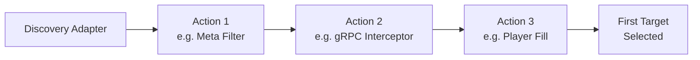

Discovery actions form a **pipeline** that processes the list of targets returned by the [discovery adapter](/adapters/target-discovery/). Each action transforms the target list sequentially -- filtering, reordering, or selecting servers before the final target is chosen.

## How the Pipeline Works



1. The **discovery adapter** produces an initial list of targets
2. Each **action** in the `actions` array processes the list in order
3. Actions can filter out targets, reorder them, or replace the list entirely
4. After all actions run, the **first target** in the remaining list is selected for the transfer

Actions are configured in `routes[].discovery.actions`:

```yaml
routes:
- hostname: "mc.example.net"
  discovery:
    type: dns_discovery
    domain: "servers.example.net"
    record_type: srv
    actions:
    - type: meta_filter
      name: "online-filter"
      rules:
      - key: "status"
        op: equals
        value: "online"
    - type: player_fill_strategy
      name: "fill-strategy"
      field: "players"
      max_players: 50
```

:::tip
Every action can have an optional `name` field for improved logging and debugging. It is recommended to use descriptive names.
:::

---

## Meta Filter

Filters targets based on their metadata key-value pairs. All rules must match for a target to pass (AND logic).

```yaml
actions:
- type: meta_filter
  rules:
  - key: "status"
    op: equals
    value: "online"
  - key: "gamemode"
    op: in
    value: ["survival", "creative"]
```

### Filter Operations

| Operation | Requires `value` | Description |
|-----------|-----------------|-------------|
| `equals` | string | Metadata field must equal the value |
| `not_equals` | string | Metadata field must not equal the value |
| `exists` | -- | Metadata field must exist (any value) |
| `not_exists` | -- | Metadata field must not exist |
| `in` | array of strings | Metadata field must be one of the values |
| `not_in` | array of strings | Metadata field must not be any of the values |

### Examples

**Filter by server type:**
```yaml
- type: meta_filter
  rules:
  - key: "type"
    op: equals
    value: "lobby"
```

**Filter by region (multiple allowed):**
```yaml
- type: meta_filter
  rules:
  - key: "region"
    op: in
    value: ["eu-west", "eu-central"]
```

**Exclude maintenance servers:**
```yaml
- type: meta_filter
  rules:
  - key: "maintenance"
    op: not_exists
```

**Combine multiple conditions (all must match):**
```yaml
- type: meta_filter
  rules:
  - key: "status"
    op: equals
    value: "online"
  - key: "type"
    op: equals
    value: "lobby"
  - key: "version"
    op: in
    value: ["1.21.4", "1.21.5"]
```

---

## Player Allow Filter

Whitelists players by username, username regex pattern, or UUID. Only players matching at least one criterion can proceed. If all fields are empty/null, **all players are blocked**.

```yaml
actions:
- type: player_allow_filter
  usernames:
  - "AdminPlayer"
  - "Moderator1"
  ids:
  - "069a79f4-44e9-4726-a5be-fca90e38aaf5"
```

### Fields

| Field | Type | Default | Description |
|-------|------|---------|-------------|
| `usernames` | array of strings (optional) | `null` | Exact usernames to allow. Disabled if null. |
| `username` | string (optional) | `null` | Regex pattern to match usernames. Disabled if null. |
| `ids` | array of strings (optional) | `null` | Player UUIDs to allow. Disabled if null. |

### Examples

**Allow specific players:**
```yaml
- type: player_allow_filter
  usernames: ["AdminPlayer", "VIPUser"]
```

**Allow by regex (e.g., staff naming convention):**
```yaml
- type: player_allow_filter
  username: "^(Admin|Mod)_.*"
```

**Allow by UUID:**
```yaml
- type: player_allow_filter
  ids: ["069a79f4-44e9-4726-a5be-fca90e38aaf5"]
```

---

## Player Block Filter

Blacklists players by username, username regex pattern, or UUID. Players matching any criterion are disconnected. If all fields are empty/null, **all players are allowed**.

```yaml
actions:
- type: player_block_filter
  usernames:
  - "BannedPlayer"
  username: "^Bot_.*"
```

### Fields

| Field | Type | Default | Description |
|-------|------|---------|-------------|
| `usernames` | array of strings (optional) | `null` | Exact usernames to block. Disabled if null. |
| `username` | string (optional) | `null` | Regex pattern to match usernames to block. Disabled if null. |
| `ids` | array of strings (optional) | `null` | Player UUIDs to block. Disabled if null. |

---

## Player Fill Strategy

Reorders targets so that the fullest server below the `max_players` capacity is selected first. Servers at or above `max_players` are skipped. Among servers with equal player counts, one is chosen randomly.

```yaml
actions:
- type: player_fill_strategy
  field: "players"
  max_players: 50
```

### Fields

| Field | Type | Default | Description |
|-------|------|---------|-------------|
| `field` | string | `""` | Metadata key containing the current player count. |
| `max_players` | integer | `0` | Maximum players per server. Servers at or above this limit are skipped. |

### How It Works

Given targets with metadata:
```
hub-1: players=45, hub-2: players=38, hub-3: players=50
```

With `max_players: 50`:
1. `hub-3` is excluded (at capacity)
2. `hub-1` (45 players) is preferred over `hub-2` (38 players) -- fills the fullest server first
3. Player is transferred to `hub-1`

:::note[Player Count Source]
The `field` value must be present in the target metadata. Static metadata in `fixed_discovery` targets won't update automatically. Use `dns_discovery`, `agones_discovery`, or `grpc_discovery` with dynamic metadata for accurate player counts.
:::

---

## gRPC Action

Delegates the action to a custom gRPC service. The service receives the current target list and player information, and returns a modified list. This allows for arbitrary custom logic like region-based routing, skill-based matchmaking, or queue systems.

```yaml
actions:
- type: grpc
  name: "custom-router"
  address: "http://router-service:50051"
```

### Fields

| Field | Type | Default | Description |
|-------|------|---------|-------------|
| `address` | string | `""` | The gRPC service endpoint URL. |

### gRPC Service Definition

The service must implement the `DiscoveryAction` service from `discovery_action.proto`:

```protobuf
service DiscoveryAction {
    rpc Apply(ApplyRequest) returns (ApplyResponse);
}
```

The `ApplyRequest` includes:
- `client` (`ClientInfo`): Client address, server address, protocol version
- `player` (`PlayerInfo`): Player name and UUID
- `targets` (repeated `Target`): The current target list to process

The `ApplyResponse` uses a `oneof` field:
- Return `targets` (a `Targets` message) with the modified target list
- Return a `key` (string) to reject the connection with a localization key

See the [gRPC Protocol Reference](/reference/grpc-protocol/) for full message definitions and the [Custom gRPC Adapters](/advanced/grpc-adapters/) guide for implementation examples.

---

## Pipeline Examples

### Simple: Filter and Fill

Filter out offline servers, then fill the fullest available server:

```yaml
discovery:
  type: fixed_discovery
  targets:
  - identifier: "lobby-1"
    address: "10.0.1.10:25565"
    meta:
      status: "online"
      players: "45"
  - identifier: "lobby-2"
    address: "10.0.1.11:25565"
    meta:
      status: "online"
      players: "38"
  - identifier: "lobby-3"
    address: "10.0.1.12:25565"
    meta:
      status: "maintenance"
      players: "0"
  actions:
  - type: meta_filter
    name: "online-only"
    rules:
    - key: "status"
      op: equals
      value: "online"
  - type: player_fill_strategy
    name: "fill"
    field: "players"
    max_players: 50
```

### Advanced: Filter, Intercept, Fill

Combine built-in filters with a custom gRPC interceptor:

```yaml
discovery:
  type: dns_discovery
  domain: "servers.example.net"
  record_type: srv
  actions:
  - type: meta_filter
    name: "server-filter"
    rules:
    - key: "status"
      op: equals
      value: "online"
  - type: grpc
    name: "custom-interceptor"
    address: "http://interceptor:50051"
  - type: player_fill_strategy
    name: "player-fill"
    field: "players"
    max_players: 50
```

### Whitelist-Only Server

Only allow specific players:

```yaml
discovery:
  type: fixed_discovery
  targets:
  - identifier: "beta-server"
    address: "10.0.1.10:25565"
  actions:
  - type: player_allow_filter
    name: "beta-whitelist"
    usernames: ["Tester1", "Tester2", "AdminPlayer"]
```
