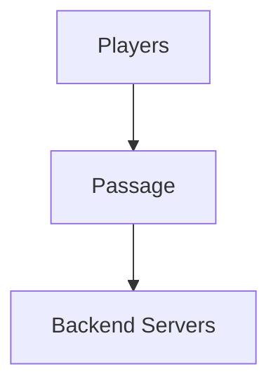
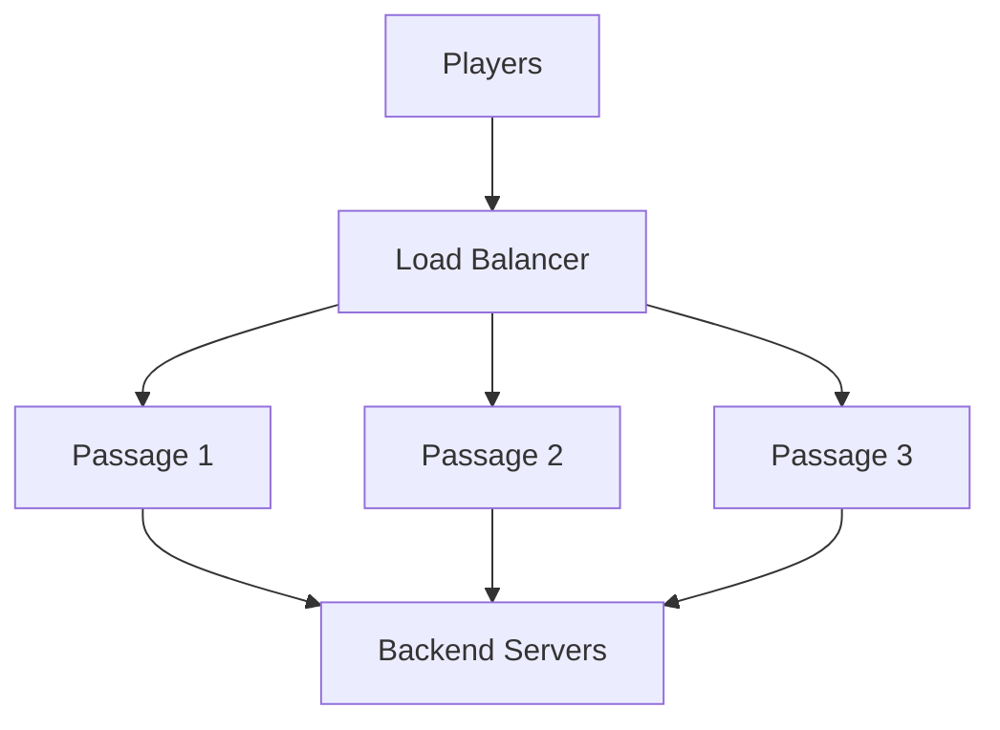
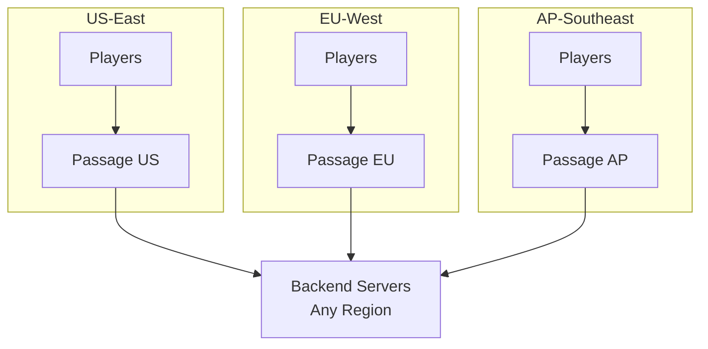

Passage is designed from the ground up to scale horizontally across multiple instances with zero coordination overhead. This guide covers scaling strategies, performance optimization, and best practices for high-traffic deployments.

## Why Passage Scales Better Than Traditional Proxies

Traditional Minecraft proxies like Velocity and BungeeCord face significant scaling challenges because they maintain persistent connections to players. Passage's stateless architecture eliminates these bottlenecks:

### Stateless Design Benefits

- **No player state**: Passage doesn't track player sessions after transfer
- **Zero coordination**: Instances don't communicate with each other
- **Instant failover**: Players reconnect to any available instance
- **Zero-downtime deploys**: Rolling updates without disconnecting players
- **Linear scaling**: Each instance handles the same load independently

### Performance Characteristics

```
Traditional Proxy (per instance):
├─ 5,000-10,000 concurrent players
├─ 2-4 GB RAM baseline
├─ Packet transcoding overhead
└─ State synchronization complexity

Passage (per instance):
├─ 50,000+ concurrent handshakes/minute
├─ 2-5 MB RAM baseline
├─ Zero packet transcoding
└─ No state synchronization needed
```

## Horizontal Scaling Architecture

### Single Instance (Development/Small Networks)

For networks with < 500 players online, a single Passage instance is sufficient:



**Recommended Resources**:
- CPU: 1 core
- RAM: 5 MB
- Network: 1 Gbps

### Multi-Instance (Production/Large Networks)

For networks with 500+ players online, deploy multiple Passage instances behind a load balancer:



**Key Benefits**:
- **High availability**: If one instance fails, others continue serving
- **Load distribution**: Spread connection load across multiple instances
- **Rolling updates**: Update instances one-by-one without downtime
- **Geographic distribution**: Deploy instances closer to players

## Kubernetes Scaling Strategy

### Horizontal Pod Autoscaler (HPA)

Automatically scale Passage based on CPU or custom metrics:

```yaml
apiVersion: autoscaling/v2
kind: HorizontalPodAutoscaler
metadata:
  name: passage-hpa
  namespace: minecraft
spec:
  scaleTargetRef:
    apiVersion: apps/v1
    kind: Deployment
    name: passage
  minReplicas: 3
  maxReplicas: 20
  metrics:
  # Scale based on CPU
  - type: Resource
    resource:
      name: cpu
      target:
        type: Utilization
        averageUtilization: 70

  # Scale based on memory
  - type: Resource
    resource:
      name: memory
      target:
        type: Utilization
        averageUtilization: 80

  behavior:
    scaleUp:
      stabilizationWindowSeconds: 60
      policies:
      - type: Percent
        value: 50  # Scale up by 50% of current replicas
        periodSeconds: 60
      - type: Pods
        value: 2   # Or add 2 pods
        periodSeconds: 60
      selectPolicy: Max

    scaleDown:
      stabilizationWindowSeconds: 300
      policies:
      - type: Percent
        value: 10  # Scale down by 10% of current replicas
        periodSeconds: 60
      selectPolicy: Min
```

### Custom Metrics Autoscaling

Scale based on connection rate using Prometheus metrics:

```yaml
apiVersion: autoscaling/v2
kind: HorizontalPodAutoscaler
metadata:
  name: passage-hpa-connections
  namespace: minecraft
spec:
  scaleTargetRef:
    apiVersion: apps/v1
    kind: Deployment
    name: passage
  minReplicas: 3
  maxReplicas: 20
  metrics:
  # Scale based on connections per second (custom metric)
  - type: Pods
    pods:
      metric:
        name: passage_connections_per_second
      target:
        type: AverageValue
        averageValue: "100"  # 100 connections/sec per pod
```

**Prometheus Query**:
```promql
rate(passage_connections_total[1m])
```

### Pod Disruption Budget

Ensure availability during voluntary disruptions (node drains, updates):

```yaml
apiVersion: policy/v1
kind: PodDisruptionBudget
metadata:
  name: passage-pdb
  namespace: minecraft
spec:
  minAvailable: 2
  selector:
    matchLabels:
      app: passage
```

This ensures at least 2 Passage pods remain available during node maintenance or rolling updates.

## Load Balancer Configuration

### Layer 4 Load Balancing (Recommended)

Use TCP load balancing for best performance and lowest latency:

**AWS Network Load Balancer**:
```yaml
apiVersion: v1
kind: Service
metadata:
  name: passage
  namespace: minecraft
  annotations:
    service.beta.kubernetes.io/aws-load-balancer-type: "nlb"
    service.beta.kubernetes.io/aws-load-balancer-cross-zone-load-balancing-enabled: "true"
    service.beta.kubernetes.io/aws-load-balancer-backend-protocol: "tcp"
    # Enable PROXY protocol to preserve client IPs
    service.beta.kubernetes.io/aws-load-balancer-proxy-protocol: "*"
spec:
  type: LoadBalancer
  externalTrafficPolicy: Local  # Preserve source IP
  ports:
  - name: minecraft
    port: 25565
    protocol: TCP
    targetPort: 25565
  selector:
    app: passage
```

**GCP Network Load Balancer**:
```yaml
apiVersion: v1
kind: Service
metadata:
  name: passage
  namespace: minecraft
  annotations:
    cloud.google.com/load-balancer-type: "External"
spec:
  type: LoadBalancer
  externalTrafficPolicy: Local
  ports:
  - name: minecraft
    port: 25565
    protocol: TCP
    targetPort: 25565
  selector:
    app: passage
```

### PROXY Protocol Support

When using load balancers, enable PROXY protocol to preserve client IP addresses:

**Passage Configuration**:
```toml
[proxy_protocol]
enabled = true

[rate_limiter]
enabled = true
duration = 60
size = 60  # 60 connections per minute per IP
```

This is crucial for rate limiting and security features that rely on client IP addresses.

### Load Balancing Algorithms

Different algorithms suit different use cases:

| Algorithm | Best For | Trade-offs |
|-----------|----------|------------|
| **Round Robin** | Even distribution | May overload slow instances |
| **Least Connections** | Variable connection times | Requires connection tracking |
| **IP Hash** | Cookie-based auth | Uneven distribution with NAT |
| **Random** | Simple, stateless | May cause temporary imbalance |

**Recommendation**: Use **Round Robin** or **Random** for Passage since all instances are stateless and connections are short-lived.

## Rate Limiting at Scale

### Per-Instance Rate Limiting

Passage includes built-in rate limiting to prevent abuse:

```toml
[rate_limiter]
enabled = true
duration = 60      # Time window in seconds
size = 60          # Max connections per IP per window
```

**How it Works**:
- Tracks connections per client IP using a sliding window algorithm
- Memory-efficient: automatically cleans up old entries
- Per-instance: each Passage instance tracks independently

**Scaling Behavior**:
```
With 3 Passage instances and rate limit = 60/min:
└─ Effective limit per IP: 180 connections/min (60 per instance)
```

To maintain strict per-IP limits across instances, use external rate limiting (see below).

### External Rate Limiting

For stricter rate limiting across all instances, use external solutions:

**Option 1: Load Balancer Rate Limiting**

AWS WAF with rate limiting:
```json
{
  "Rules": [{
    "Name": "MinecraftConnectionRateLimit",
    "Priority": 1,
    "Statement": {
      "RateBasedStatement": {
        "Limit": 100,
        "AggregateKeyType": "IP"
      }
    },
    "Action": {
      "Block": {}
    }
  }]
}
```

**Option 2: Shared Redis Rate Limiter**

For custom rate limiting logic, integrate Redis (requires custom gRPC adapter):

```go
// Example: gRPC adapter with Redis rate limiting
func (s *server) SelectTarget(ctx context.Context, req *pb.SelectTargetRequest) (*pb.SelectTargetResponse, error) {
    clientIP := req.GetMetadata()["client_ip"]

    // Check rate limit in Redis
    key := fmt.Sprintf("ratelimit:%s", clientIP)
    count, err := s.redis.Incr(ctx, key).Result()
    if err != nil {
        return nil, err
    }

    if count == 1 {
        s.redis.Expire(ctx, key, 60*time.Second)
    }

    if count > 100 {
        return nil, status.Error(codes.ResourceExhausted, "rate limit exceeded")
    }

    // ... target selection logic
}
```

## Performance Optimization

### Memory Optimization

Passage has a small memory footprint, but you can optimize further:

**Disable Unused Features**:
```toml
# Disable Sentry if not needed
[sentry]
enabled = false

# Disable OpenTelemetry if not needed
[otel]
metrics_token = ""
traces_token = ""
```

**Reduce Timeouts**:
```toml
# Lower connection timeout for faster cleanup
timeout = 60  # Default: 120 seconds
```

**Resource Limits (Kubernetes)**:
```yaml
resources:
  requests:
    memory: "128Mi"
    cpu: "100m"
  limits:
    memory: "256Mi"
    cpu: "500m"
```

### CPU Optimization

Passage is built with Tokio, a multi-threaded async runtime:

**Multi-Core Scaling**:
```rust
// Automatically uses all available CPU cores
tokio::runtime::Builder::new_multi_thread()
    .enable_all()
    .build()
```

**Kubernetes CPU Allocation**:
```yaml
resources:
  requests:
    cpu: "500m"   # 0.5 cores
  limits:
    cpu: "2000m"  # 2 cores max
```

**Recommended CPU Allocation**:
| Concurrent Connections/min | CPU Cores |
|----------------------------|-----------|
| < 1,000                    | 0.5       |
| 1,000 - 5,000             | 1         |
| 5,000 - 20,000            | 2         |
| 20,000+                   | 4+        |

### Network Optimization

**Enable Keep-Alive**:
Minecraft uses TCP, so ensure keep-alive is configured on your load balancer.

**Optimize MTU**:
Ensure MTU is consistent across your network (typically 1500 for Ethernet, 9000 for jumbo frames).

**Connection Pooling for Adapters**:
When using HTTP/gRPC adapters, connection pooling is automatic. For high-traffic scenarios, increase timeouts:

```toml
# Example: HTTP adapter with caching
[status.http]
address = "https://status-service/status"
cache_duration = 5  # Cache for 5 seconds to reduce backend load
```

## Monitoring and Observability

### Key Metrics to Track

**Connection Metrics**:
- `passage_connections_total` - Total connections processed
- `passage_connections_active` - Current active connections
- `passage_rate_limiter_size` - Number of tracked IPs in rate limiter

**Adapter Metrics**:
- `passage_adapter_status_duration_seconds` - Status adapter latency
- `passage_adapter_discovery_duration_seconds` - Discovery adapter latency
- `passage_adapter_strategy_duration_seconds` - Strategy adapter latency

**System Metrics**:
- CPU utilization per pod
- Memory usage per pod
- Network throughput (bytes in/out)

### Prometheus Queries

**Connections per second**:
```promql
rate(passage_connections_total[1m])
```

**Average connection duration**:
```promql
rate(passage_connection_duration_seconds_sum[5m])
/
rate(passage_connection_duration_seconds_count[5m])
```

**Rate limiter effectiveness**:
```promql
rate(passage_rate_limit_exceeded_total[5m])
```

**Instance load distribution**:
```promql
sum(rate(passage_connections_total[1m])) by (pod)
```

### Alerting Rules

**High Error Rate**:
```yaml
- alert: PassageHighErrorRate
  expr: |
    rate(passage_errors_total[5m]) > 10
  for: 5m
  annotations:
    summary: "High error rate in Passage"
    description: "{{ $value }} errors/sec in namespace {{ $labels.namespace }}"
```

**High Latency**:
```yaml
- alert: PassageHighLatency
  expr: |
    histogram_quantile(0.99,
      rate(passage_connection_duration_seconds_bucket[5m])
    ) > 2
  for: 5m
  annotations:
    summary: "High connection latency in Passage"
    description: "P99 latency is {{ $value }}s"
```

**Pod Unavailable**:
```yaml
- alert: PassagePodsUnavailable
  expr: |
    kube_deployment_status_replicas_available{deployment="passage"} < 2
  for: 2m
  annotations:
    summary: "Less than 2 Passage pods available"
```

## Capacity Planning

### Connection Rate Estimation

Calculate required capacity based on expected player activity:

**Formula**:
```
Required Capacity (connections/min) =
    (Peak Players × Reconnection Rate) + New Connections/min

Where:
- Peak Players: Max concurrent players online
- Reconnection Rate: % of players that reconnect per minute (typically 2-5%)
- New Connections/min: Expected new player logins per minute
```

**Example**:
```
10,000 peak players
× 3% reconnection rate = 300 reconnections/min
+ 100 new connections/min
= 400 connections/min total

Required instances (at 100 conn/min per instance): 4-5 instances
Recommended with HA: 6 instances (3 for load, 3 for redundancy)
```

### Instance Sizing Guide

| Network Size | Peak Players | Instances | CPU per Pod | RAM per Pod |
|--------------|--------------|-----------|-------------|-------------|
| Small        | < 500        | 1         | 0.5 cores   | 3 MB        |
| Medium       | 500-2,000    | 1-3       | 1 core      | 5 MB        |
| Large        | 2,000-10,000 | 2-3       | 2 cores     | 10 MB       |
| Enterprise   | 10,000+      | 3-5       | 2 cores     | 15 MB       |

**Headroom Recommendation**: Always provision 50% extra capacity for traffic spikes and failover scenarios.

## Geographic Distribution

### Multi-Region Deployment

For global networks, deploy Passage in multiple regions:



**Benefits**:
- Lower latency for players worldwide
- Regional failover capabilities
- Compliance with data residency requirements

**Implementation**:
1. Deploy Passage in each region using local Kubernetes clusters
2. Use GeoDNS to route players to nearest Passage instance
3. Backend servers can be in any region (transfer is fast)

**GeoDNS Configuration** (AWS Route 53):
```json
{
  "Type": "A",
  "Name": "play.example.com",
  "GeoLocation": {
    "ContinentCode": "NA"
  },
  "ResourceRecords": ["1.2.3.4"],
  "TTL": 60
}
```

## Scaling Checklist

Before deploying Passage at scale, verify:

### Infrastructure
- ✅ Load balancer supports TCP passthrough
- ✅ PROXY protocol enabled (if using load balancer)
- ✅ Kubernetes cluster has sufficient node capacity
- ✅ Network bandwidth supports expected traffic
- ✅ DNS TTL is low enough for fast failover (< 300s)

### Configuration
- ✅ Rate limiting configured appropriately
- ✅ Adapter endpoints are highly available
- ✅ Authentication cookies enabled for repeat connections
- ✅ Timeouts tuned for your network latency

### Reliability
- ✅ Minimum 3 replicas for high availability
- ✅ HPA configured with appropriate metrics
- ✅ Pod disruption budget prevents full outages
- ✅ Anti-affinity rules spread pods across nodes/zones
- ✅ Health checks configured (liveness/readiness probes)

### Monitoring
- ✅ Prometheus scraping Passage metrics
- ✅ Grafana dashboards for connection rates, latency
- ✅ Alerts configured for high error rate, latency, pod unavailability
- ✅ Logs aggregated and searchable

### Testing
- ✅ Load testing completed at 2x expected peak
- ✅ Failover testing (kill pods, nodes)
- ✅ Rolling update testing (zero downtime)
- ✅ Rate limiting validation

## Troubleshooting Scaling Issues

### Issue: Uneven Load Distribution

**Symptoms**: Some pods handle 10x more connections than others

**Causes**:
- IP hash load balancing with many players behind NAT
- Cookie-based authentication causing sticky sessions
- DNS caching by clients

**Solutions**:
1. Switch to round-robin or random load balancing
2. Reduce DNS TTL to 60 seconds
3. Ensure load balancer doesn't have session affinity enabled

### Issue: High Memory Usage

**Symptoms**: Pods consuming > 10 MB RAM, OOMKilled events

**Causes**:
- Rate limiter tracking too many IPs
- Long timeout values keeping connections open
- Memory leak (unlikely, but report if suspected)

**Solutions**:
```toml
# Reduce timeout
timeout = 60  # Down from 120

# Tighten rate limiter window
[rate_limiter]
duration = 30  # Down from 60
```

Restart pods to clear rate limiter state.

### Issue: Connection Spikes Causing Throttling

**Symptoms**: Players can't connect during peak times, rate limit errors

**Causes**:
- Insufficient instances for load
- HPA not scaling fast enough
- Rate limiter too strict

**Solutions**:
1. Increase HPA `minReplicas` to handle baseline load
2. Adjust HPA scale-up behavior for faster scaling:
   ```yaml
   scaleUp:
     stabilizationWindowSeconds: 30  # Down from 60
     policies:
     - type: Percent
       value: 100  # Double replicas quickly
   ```
3. Increase rate limit:
   ```toml
   [rate_limiter]
   size = 100  # Up from 60
   ```

### Issue: Backend Adapter Latency

**Symptoms**: High P99 latency for connections, slow transfers

**Causes**:
- Slow HTTP/gRPC adapter responses
- Backend discovery service overloaded
- Network latency to adapter

**Solutions**:
1. Enable caching for HTTP adapters:
   ```toml
   [status.http]
   cache_duration = 5  # Cache for 5 seconds
   ```
2. Scale backend adapter services
3. Use co-located adapters (same cluster/region)
4. Switch to simpler adapters (e.g., Fixed instead of gRPC for static configs)


## Summary

Passage's stateless architecture enables:
- ✅ **Linear horizontal scaling** without coordination overhead
- ✅ **Zero-downtime deployments** with rolling updates
- ✅ **High availability** with multi-instance setups
- ✅ **Geographic distribution** for global networks
- ✅ **Cost efficiency** with small resource footprint

Key takeaways:
1. Always deploy at least 3 instances for production
2. Use HPA for automatic scaling based on load
3. Monitor connection rate, latency, and error rate
4. Enable PROXY protocol to preserve client IPs
5. Test failover scenarios before going live
