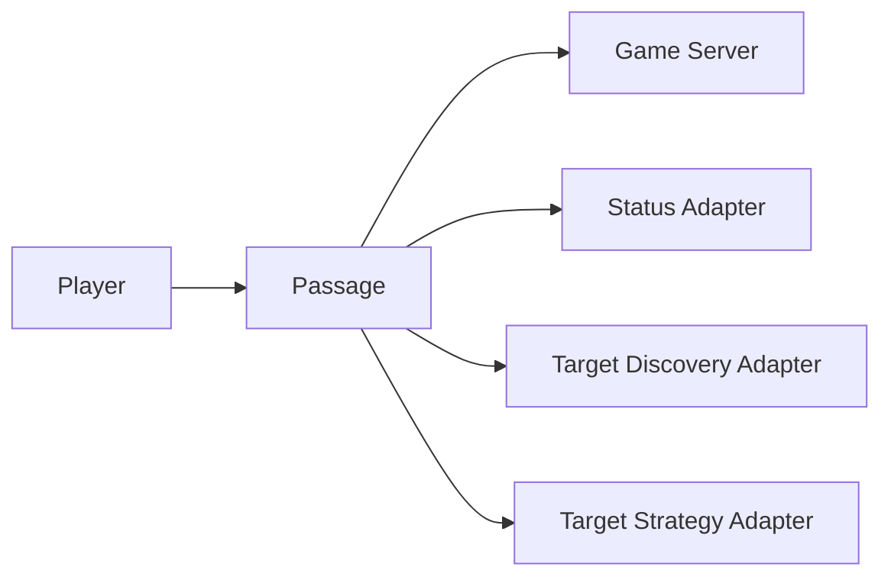
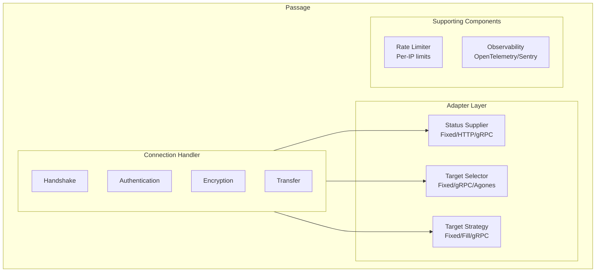
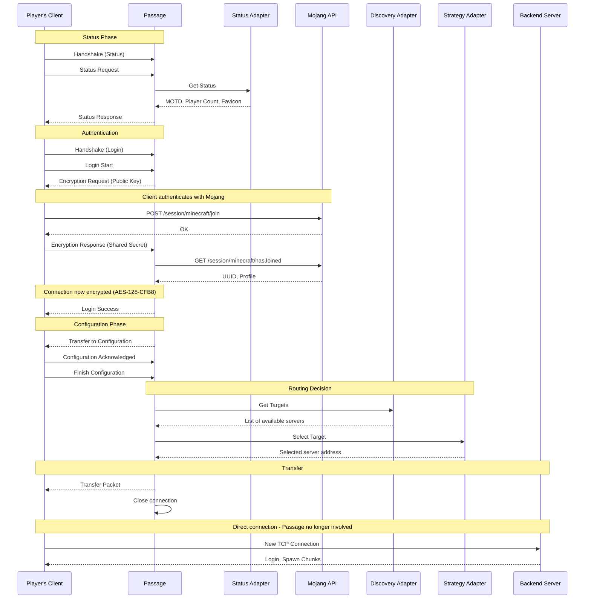

Passage is built on a modular, adapter-based architecture that separates concerns into three distinct phases. This design allows for maximum flexibility while maintaining simplicity.

## High-Level Overview



## The Three-Phase Connection Flow

Every player connection goes through three distinct phases:

### Phase 1: Status & Authentication

When a player first connects, Passage:

1. **Receives the handshake** and status request
2. **Queries the Status Adapter** for server information (MOTD, player count, favicon)
3. **Returns the status** to the client
4. **Authenticates with Mojang** using the player's username and shared secret
5. **Encrypts the connection** using AES-128-CFB8
6. **Optionally handles resource packs** if configured

This phase ensures only legitimate players proceed to routing.

### Phase 2: Target Discovery

Once authenticated, Passage needs to know which backend servers are available:

1. **Queries the Target Discovery Adapter**
2. **Receives a list of available targets** with metadata
3. **Each target includes**:
   - Unique identifier
   - Network address (IP:port)
   - Metadata (key-value pairs like player count, server type, etc.)

Examples of discovery adapters:
- **Fixed**: Static list from configuration
- **gRPC**: Dynamic list from a custom service
- **Agones**: Auto-discovery of Kubernetes game servers

### Phase 3: Target Strategy

With the list of available servers, Passage selects the best one:

1. **Queries the Target Strategy Adapter** with:
   - List of available targets
   - Player information (UUID, username)
   - Client address and protocol version
2. **Strategy returns the selected target**
3. **Passage sends the Transfer packet** with the target address
4. **Connection closes** - player is now directly connected to the backend

Examples of strategy adapters:
- **Fixed**: Always select the first available target
- **Player Fill**: Fill servers sequentially to maximize occupancy
- **gRPC**: Custom logic (e.g., region-based, queue priority, etc.)

## Adapter System

### Why Adapters?

The adapter pattern allows Passage to remain:
- **Simple**: Core logic is unchanged regardless of your deployment
- **Flexible**: Swap adapters without modifying code
- **Extensible**: Implement custom gRPC adapters for your specific needs

### Built-in Adapters

#### Status Adapters
- **Fixed**: Static configuration (name, MOTD, favicon)
- **HTTP**: Query status from HTTP endpoint with caching
- **gRPC**: Dynamic status from custom service

#### Target Discovery Adapters
- **Fixed**: Static server list from config
- **gRPC**: Dynamic server list from custom service
- **Agones**: Kubernetes game server auto-discovery

#### Target Strategy Adapters
- **Fixed**: Simple first-available selection
- **Player Fill**: Fill servers to capacity before starting new ones
- **gRPC**: Custom selection logic

## Component Diagram



## Detailed Connection Walkthrough

Let's follow a player as they connect to your Minecraft network through Passage:

### Step 1: Initial Connection (Status Phase)

The player's Minecraft client opens a TCP connection to Passage and sends a **Handshake packet** with:
- Server address (e.g., `play.example.com`)
- Server port: `25565`
- Protocol version (e.g., `769` for Minecraft 1.21)
- Next state: Status (2)

Passage receives the handshake and transitions to **Status state**.

### Step 2: Server List Ping

Passage queries the Status Adapter and returns the server information to the client. The player sees your server in their server list with the configured MOTD, player count, and favicon.

### Step 3: Login Initiation

When the player clicks "Join Server", the client sends a Login Start packet and Passage responds with an Encryption Request containing the public key.

### Step 4: Client-Side Authentication

The player's client now:
1. Generates a shared secret (16 random bytes)
2. Computes the server hash using Mojang's algorithm
3. **Authenticates with Mojang's session servers**:
   ```
   POST https://sessionserver.mojang.com/session/minecraft/join
   {
     "accessToken": "player's access token",
     "selectedProfile": "player's UUID",
     "serverId": "computed server hash"
   }
   ```
4. Encrypts the shared secret and verify token with Passage's public key
5. Sends **Encryption Response** to Passage

### Step 5: Server-Side Authentication

Passage decrypts the response, verifies with Mojang's `hasJoined` endpoint, and receives the player's profile (UUID, name, properties). The connection is now encrypted with AES-128-CFB8, and Passage sends Login Success.

### Step 6: Configuration Phase

Passage can optionally:
- Request the client to download resource packs
- Store cookies for authentication persistence
- Configure other client settings

### Step 7: Target Discovery

Passage queries the Target Discovery Adapter to get a list of available backend servers with their metadata (player counts, server types, etc.).

### Step 8: Target Selection

The Target Strategy Adapter selects the best server for this player based on the configured strategy (e.g., Player Fill selects the fullest server below capacity).

### Step 9: Transfer

Passage sends a Transfer Packet with the backend server's address and closes the connection. The client seamlessly reconnects to the backend server—from the player's perspective, this is instantaneous and transparent.

### Step 10: Backend Server Connection

The player is now fully connected to the backend server. Passage has no further involvement—the player's packets go directly to the backend server.

## Data Flow

### Successful Connection Flow



## What Passage Does and Doesn't Do

### Passage Does:
✅ TCP connection handling
✅ Minecraft protocol handshake
✅ Status responses (MOTD, player count)
✅ Encryption key generation
✅ Mojang authentication verification
✅ AES-128-CFB8 encryption setup
✅ Configuration phase management
✅ Server discovery and selection
✅ Transfer packet with target address

### Passage Does NOT:
❌ Maintain persistent connections
❌ Transcode game packets
❌ Proxy gameplay traffic
❌ Store player state after transfer
❌ Handle disconnects from backend

## Stateless Design Benefits

Passage's stateless architecture means:

1. **No memory per player**: After transfer, Passage has zero memory of the player
2. **Instant restart**: Restarting Passage doesn't affect connected players
3. **Horizontal scaling**: Run multiple Passage instances with simple load balancing
4. **No synchronization**: No need to sync state between instances

## Performance Characteristics

### Resource Usage

- **Memory**: Less than 5MB
- **CPU**: Minimal - mostly I/O bound
- **Network**: ~5KB per player connection (authentication + transfer)

### Timing Breakdown

Typical connection times:

| Phase | Duration | Notes |
|-------|----------|-------|
| TCP Handshake | 1-5ms | Network latency |
| Status Request | 1-10ms | Adapter query time |
| Login & Encryption | 100-500ms | Mojang API latency |
| Configuration | 10-50ms | Optional resource packs |
| Target Discovery | 1-50ms | Adapter dependent |
| Target Selection | 1-10ms | Strategy complexity |
| Transfer | 1-5ms | Packet transmission |
| Backend Connection | 50-200ms | New TCP + login |
| **Total** | **~200-800ms** | Mostly Mojang API |

The majority of time is spent waiting for Mojang's authentication servers. The actual Passage routing logic adds only ~10-60ms.

## Error Handling

### What if authentication fails?

```
Passage ← Mojang: "Invalid session"
            ↓
Player's Client ← Disconnect
                  "Failed to verify username"
```

The player is disconnected with an error message.

### What if no backend server is available?

```
Target Discovery → Empty list []
         ↓
Target Strategy → None selected
         ↓
Player's Client ← Disconnect
                  "No available server"
```

The player receives a localized error message (configurable).

### What if the target server is down?

This happens AFTER the transfer. The client will connect to the backend server and either:
- Get a connection refused error (server down)
- Timeout during connection
- Successfully connect

Passage has already closed the connection and has no involvement at this point.

## Cookie-Based Authentication

Passage supports authentication cookies to skip Mojang verification for returning players:

### First Connection
```
Player → Passage → Mojang (verify)
              ↓
         Cookie stored in client
```

### Subsequent Connections
```
Player → Passage (includes cookie)
         Passage verifies cookie signature
         Skip Mojang verification!
         → Transfer (much faster)
```

This reduces connection time from ~500ms to ~50ms for returning players.
