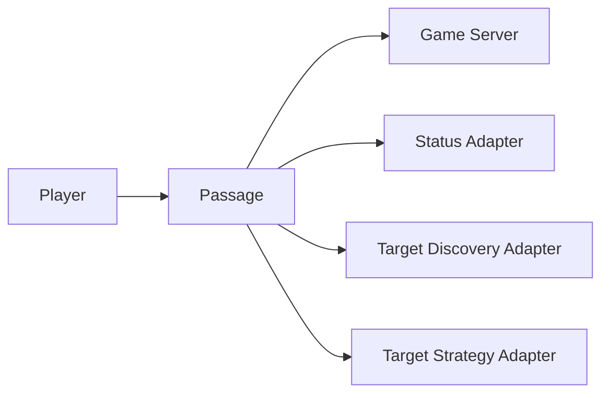
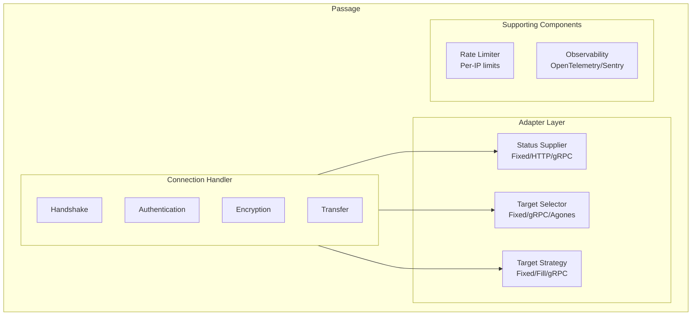
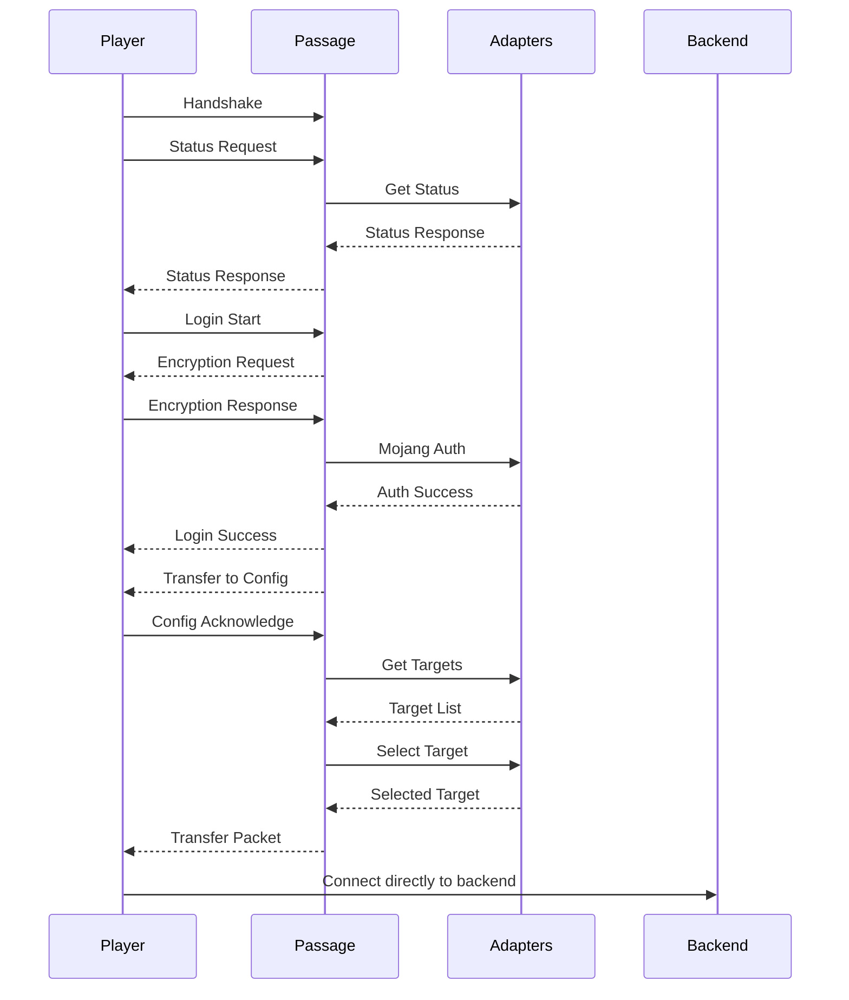

Passage is built on a modular, adapter-based architecture that separates concerns into three distinct phases. This design allows for maximum flexibility while maintaining simplicity.

## High-Level Overview

## The Three-Phase Connection Flow

Every player connection goes through three distinct phases:

### Phase 1: Status & Authentication

When a player first connects, Passage:

1. **Receives the handshake** and status request
2. **Queries the Status Adapter** for server information (MOTD, player count, favicon)
3. **Returns the status** to the client
4. **Authenticates with Mojang** using the player's username and shared secret
5. **Encrypts the connection** using AES-128-CFB8
6. **Optionally handles resource packs** if configured

This phase ensures only legitimate players proceed to routing.

### Phase 2: Target Discovery

Once authenticated, Passage needs to know which backend servers are available:

1. **Queries the Target Discovery Adapter**
2. **Receives a list of available targets** with metadata
3. **Each target includes**:
   - Unique identifier
   - Network address (IP:port)
   - Metadata (key-value pairs like player count, server type, etc.)

Examples of discovery adapters:
- **Fixed**: Static list from configuration
- **gRPC**: Dynamic list from a custom service
- **Agones**: Auto-discovery of Kubernetes game servers

### Phase 3: Target Strategy

With the list of available servers, Passage selects the best one:

1. **Queries the Target Strategy Adapter** with:
   - List of available targets
   - Player information (UUID, username)
   - Client address and protocol version
2. **Strategy returns the selected target**
3. **Passage sends the Transfer packet** with the target address
4. **Connection closes** - player is now directly connected to the backend

Examples of strategy adapters:
- **Fixed**: Always select the first available target
- **Player Fill**: Fill servers sequentially to maximize occupancy
- **gRPC**: Custom logic (e.g., region-based, queue priority, etc.)

## Adapter System

### Why Adapters?

The adapter pattern allows Passage to remain:
- **Simple**: Core logic is unchanged regardless of your deployment
- **Flexible**: Swap adapters without modifying code
- **Extensible**: Implement custom gRPC adapters for your specific needs

### Built-in Adapters

#### Status Adapters
- **Fixed**: Static configuration (name, MOTD, favicon)
- **HTTP**: Query status from HTTP endpoint with caching
- **gRPC**: Dynamic status from custom service

#### Target Discovery Adapters
- **Fixed**: Static server list from config
- **gRPC**: Dynamic server list from custom service
- **Agones**: Kubernetes game server auto-discovery

#### Target Strategy Adapters
- **Fixed**: Simple first-available selection
- **Player Fill**: Fill servers to capacity before starting new ones
- **gRPC**: Custom selection logic

## Component Diagram

## Data Flow

### Successful Connection Flow

## Stateless Design Benefits

Passage's stateless architecture means:

1. **No memory per player**: After transfer, Passage has zero memory of the player
2. **Instant restart**: Restarting Passage doesn't affect connected players
3. **Horizontal scaling**: Run multiple Passage instances with simple load balancing
4. **No synchronization**: No need to sync state between instances

## Performance Characteristics

- **Memory**: ~50-100MB base + ~10KB per concurrent connection
- **CPU**: Minimal - mostly I/O bound
- **Network**: ~5-20KB per player connection (authentication + transfer)
- **Latency**: <50ms added to connection time (depends on Mojang API)
