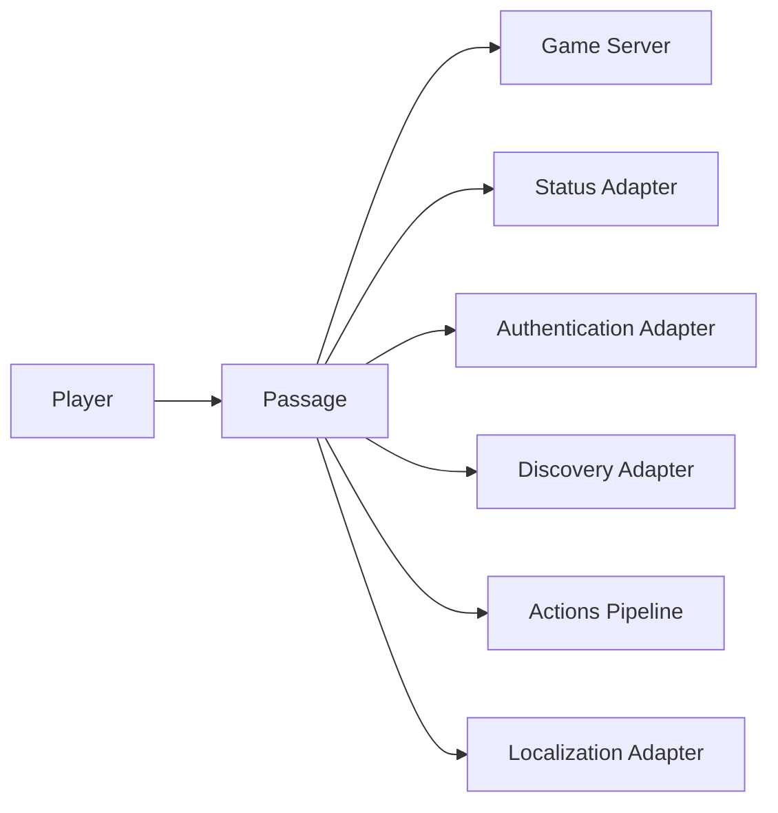
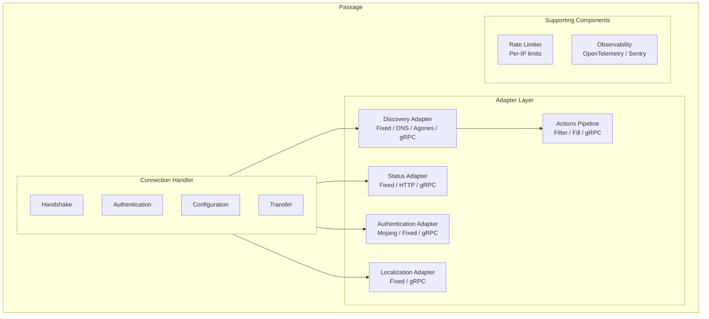
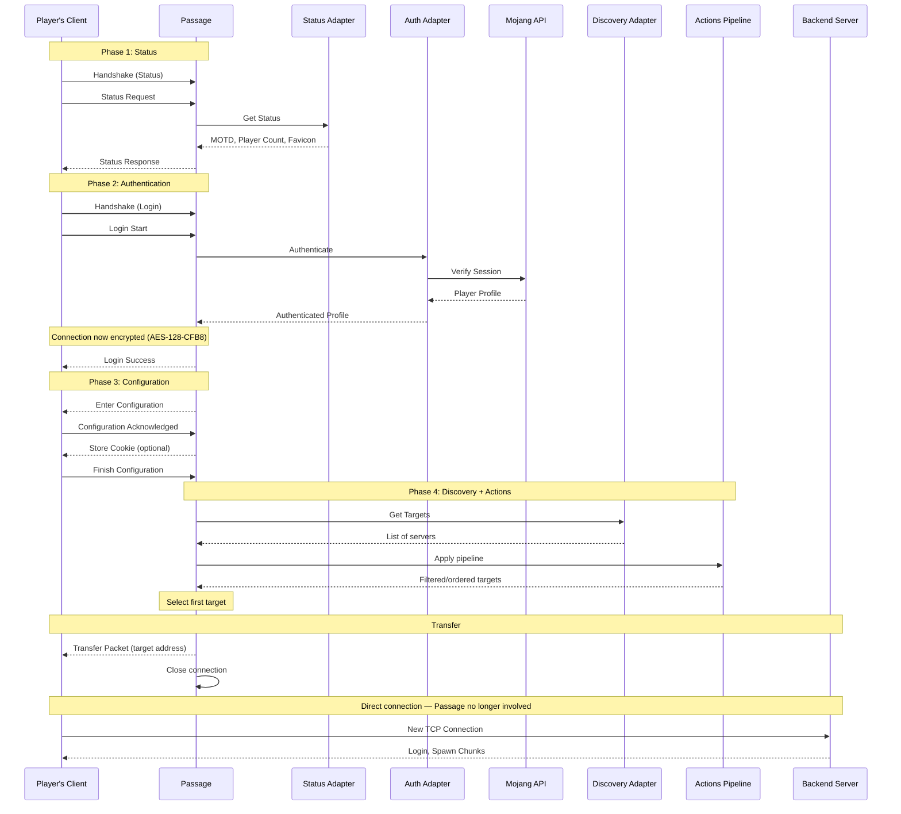

Passage is built on a modular, adapter-based architecture that separates concerns into distinct phases. This design allows for maximum flexibility while maintaining simplicity.

## High-Level Overview

```mermaid
flowchart LR
    Player[Player] --> Passage[Passage]
    Passage --> GameServer[Game Server]

    Passage --> Status[Status Adapter]
    Passage --> Auth[Authentication Adapter]
    Passage --> Discovery[Discovery Adapter]
    Passage --> Actions[Actions Pipeline]
    Passage --> Localization[Localization Adapter]
```

## The Connection Flow

Every player connection goes through four distinct phases:

### Phase 1: Status

When a player pings your server from the server list:

1. **Receives the handshake** and status request
2. **Matches the hostname** against configured routes (regex matching)
3. **Queries the Status Adapter** for that route's server information (MOTD, player count, favicon)
4. **Returns the status** to the client

### Phase 2: Authentication

When a player clicks "Join Server":

1. **Receives the login request** with the player's username
2. **Queries the Authentication Adapter** for the matched route
3. For Mojang authentication (default): verifies the player's session with Mojang's servers
4. **Encrypts the connection** using AES-128-CFB8
5. **Sends Login Success** with the player's profile

### Phase 3: Configuration

After authentication succeeds:

1. **Transitions to configuration state** (Minecraft 1.20.2+)
2. **Optionally stores authentication cookies** for faster reconnection
3. **Completes configuration** handshake with the client

### Phase 4: Discovery + Actions

With an authenticated player ready:

1. **Queries the Discovery Adapter** to get available backend servers
2. **Runs the Actions Pipeline** -- each action transforms the target list sequentially (filtering, reordering, selecting)
3. **Selects the first target** from the resulting list
4. **Sends a Transfer Packet** with the target's address
5. **Closes the connection** -- the player reconnects directly to the backend

## Adapter System

### Why Adapters?

The adapter pattern allows Passage to remain:
- **Simple**: Core logic is unchanged regardless of your deployment
- **Flexible**: Swap adapters without modifying code
- **Extensible**: Implement custom gRPC adapters for any logic you need

### Five Adapter Categories

| Category | Purpose | Options |
|----------|---------|---------|
| **Status** | Server list response | `fixed`, `http`, `grpc` |
| **Authentication** | Player identity verification | `mojang`, `disabled`, `fixed`, `grpc` |
| **Discovery** | Find available backend servers | `fixed_discovery`, `dns_discovery`, `agones_discovery`, `grpc_discovery` |
| **Discovery Actions** | Filter/reorder/select targets | `meta_filter`, `player_allow_filter`, `player_block_filter`, `player_fill_strategy`, `grpc` |
| **Localization** | Disconnect message translations | `fixed`, `grpc` |

Each route configures its own adapters independently. See [Adapter Overview](/adapters/) for details.

## Component Diagram

```mermaid
flowchart TB
    subgraph Passage
        subgraph Connection["Connection Handler"]
            H[Handshake]
            A[Authentication]
            C[Configuration]
            T[Transfer]
        end

        subgraph Adapters["Adapter Layer"]
            Status[Status Adapter<br/>Fixed / HTTP / gRPC]
            Auth[Authentication Adapter<br/>Mojang / Fixed / gRPC]
            Disc[Discovery Adapter<br/>Fixed / DNS / Agones / gRPC]
            Act[Actions Pipeline<br/>Filter / Fill / gRPC]
            Loc[Localization Adapter<br/>Fixed / gRPC]
        end

        subgraph Support["Supporting Components"]
            RL[Rate Limiter<br/>Per-IP limits]
            Obs[Observability<br/>OpenTelemetry / Sentry]
        end

        Connection --> Status
        Connection --> Auth
        Connection --> Disc
        Disc --> Act
        Connection --> Loc
    end
```

## Detailed Connection Sequence

```mermaid
sequenceDiagram
    participant Client as Player's Client
    participant Passage
    participant StatusAdapter as Status Adapter
    participant AuthAdapter as Auth Adapter
    participant Mojang as Mojang API
    participant Discovery as Discovery Adapter
    participant Actions as Actions Pipeline
    participant Backend as Backend Server

    Note over Client,Passage: Phase 1: Status
    Client->>Passage: Handshake (Status)
    Client->>Passage: Status Request
    Passage->>StatusAdapter: Get Status
    StatusAdapter-->>Passage: MOTD, Player Count, Favicon
    Passage-->>Client: Status Response

    Note over Client,Passage: Phase 2: Authentication
    Client->>Passage: Handshake (Login)
    Client->>Passage: Login Start
    Passage->>AuthAdapter: Authenticate
    AuthAdapter->>Mojang: Verify Session
    Mojang-->>AuthAdapter: Player Profile
    AuthAdapter-->>Passage: Authenticated Profile

    Note over Client,Passage: Connection now encrypted (AES-128-CFB8)
    Passage-->>Client: Login Success

    Note over Client,Passage: Phase 3: Configuration
    Passage-->>Client: Enter Configuration
    Client->>Passage: Configuration Acknowledged
    Passage-->>Client: Store Cookie (optional)
    Client->>Passage: Finish Configuration

    Note over Passage,Actions: Phase 4: Discovery + Actions
    Passage->>Discovery: Get Targets
    Discovery-->>Passage: List of servers
    Passage->>Actions: Apply pipeline
    Actions-->>Passage: Filtered/ordered targets
    Note over Passage: Select first target

    Note over Client,Backend: Transfer
    Passage-->>Client: Transfer Packet (target address)
    Passage->>Passage: Close connection

    Note over Client,Backend: Direct connection — Passage no longer involved
    Client->>Backend: New TCP Connection
    Backend-->>Client: Login, Spawn Chunks
```

## What Passage Does and Doesn't Do

**Passage handles:**
- TCP connection handling and Minecraft protocol handshake
- Status responses (MOTD, player count, favicon)
- Player authentication (Mojang or custom)
- AES-128-CFB8 encryption
- Configuration phase and cookie management
- Server discovery and target selection via actions pipeline
- Transfer packet delivery

**Passage does NOT:**
- Maintain persistent connections after transfer
- Transcode or proxy gameplay traffic
- Store player state after transfer
- Handle disconnects from backend servers

## Stateless Design Benefits

After transferring a player, Passage has zero memory of that connection. This means:

1. **No memory per player**: Resource usage doesn't scale with connected players
2. **Instant restart**: Restarting Passage doesn't affect players already transferred to backends
3. **Horizontal scaling**: Run multiple Passage instances behind any TCP load balancer
4. **No synchronization**: No state to sync between instances

## Performance Characteristics

| Phase | Duration | Notes |
|-------|----------|-------|
| TCP Handshake | 1-5ms | Network latency |
| Status Request | 1-10ms | Adapter query time |
| Authentication | 100-500ms | Mojang API latency (dominant factor) |
| Configuration | 10-50ms | Cookie storage, handshake |
| Discovery + Actions | 1-50ms | Adapter and pipeline complexity |
| Transfer | 1-5ms | Packet transmission |
| Backend Connection | 50-200ms | New TCP + login on backend |
| **Total** | **~200-800ms** | Mostly Mojang API |

The majority of time is spent waiting for Mojang's authentication servers. The actual Passage routing logic adds only ~10-60ms.

## Cookie-Based Authentication

Passage supports authentication cookies to skip Mojang verification for returning players:

**First connection:**
1. Player authenticates via Mojang (slow)
2. Passage stores an HMAC-SHA256 signed cookie in the client

**Subsequent connections:**
1. Player presents the cookie
2. Passage verifies the signature (fast, no external call)
3. Transfer happens immediately

This reduces connection time from ~500ms to ~50ms for returning players. See [Authentication Cookies](/advanced/cookies/) for configuration details.

## Error Handling

**Authentication fails:** The player is disconnected with the `disconnect_unauthenticated` localization message.

**No backend server available:** If discovery returns no targets, or all targets are filtered out by the actions pipeline, the player receives the `disconnect_no_target` message.

**Backend server is down:** This happens *after* the transfer. The client connects to the backend server directly and will see a connection refused or timeout error. Passage is no longer involved at this point.
