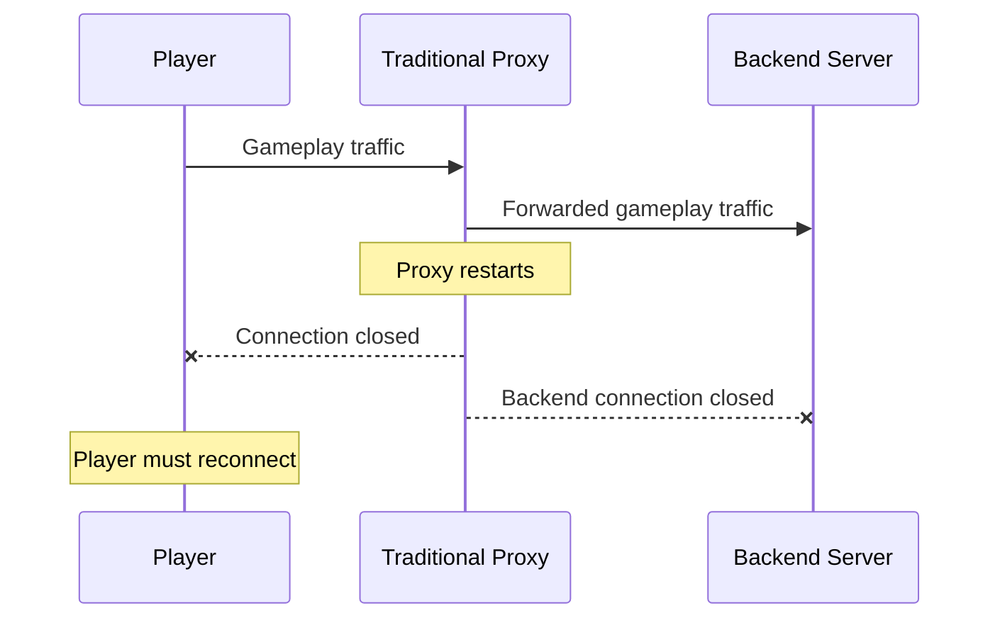
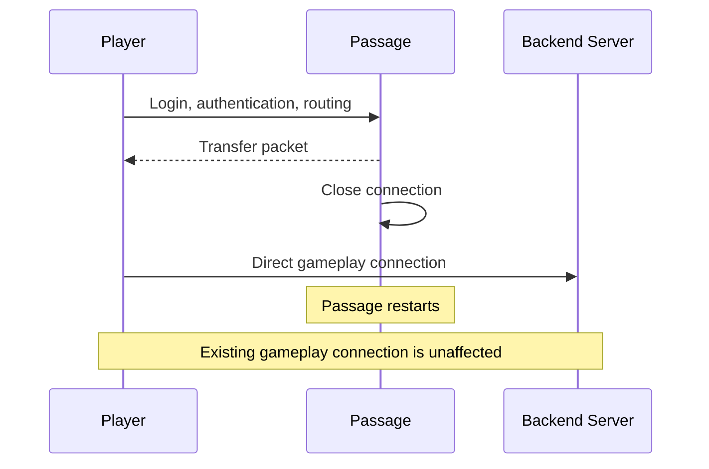
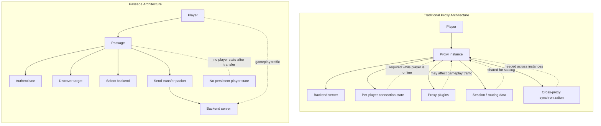

Passage aims to replace existing proxy solutions like [Velocity](https://github.com/PaperMC/Velocity), [Gate](https://gate.minekube.com/), [Waterfall](https://github.com/PaperMC/Waterfall), and [BungeeCord](https://github.com/SpigotMC/BungeeCord). We're convinced that Passage is the ideal way to connect modern Minecraft networks to the internet and that there are many advantages in using Passage over conventional Minecraft network proxies.

In this document, we've summarized the biggest pros and some things you may want to consider when using Passage.

:::caution
This comparison may be biased, but we've done our best to give you an accurate overview of the pros and cons of choosing Passage versus choosing any conventional proxy software.
:::

## Quick Comparison

| Feature | BungeeCord | Waterfall | Velocity | Gate | Passage |
|---------|------------|-----------|----------|------|---------|
| **Performance** |
| Resource efficient | ❌ | ✅ | ✅✅ | ✅✅✅ | ✅✅✅✅ |
| Native binary | ❌ (JVM) | ❌ (JVM) | ❌ (JVM) | ✅ (Go) | ✅ (Rust) |
| Stateless (zero memory per player) | ❌ | ❌ | ❌ | ❌ | ✅ |
| Packet transcoding | ✅ (slow) | ✅ (slow) | ✅ (fast) | ✅ (fast) | ❌ (none!) |
| **Scalability** |
| Horizontal scaling | ⚠️ Complex | ⚠️ Complex | ⚠️ Complex | ✅ Good | ✅✅ Trivial |
| Stateless | ❌ | ❌ | ❌ | ❌ | ✅ |
| Zero-downtime deploys | ❌ | ❌ | ❌ | ❌ | ✅ |
| **Features** |
| Plugins/extensions | ✅ | ✅ | ✅ | ❌ | ❌ |
| Secure player forwarding | ❌ | ❌ | ✅ | ✅ | ✅ |
| Mojang chat signing | ⚠️ Limited | ⚠️ Limited | ⚠️ Limited | ⚠️ Limited | ✅ Full |
| Resource pack handling | ✅ | ✅ | ✅ | ✅ | N/A |
| **Version Support** |
| Latest Minecraft version | ⚠️ After update | ⚠️ After update | ✅ Usually | ✅ Fast | ✅✅ Always |
| Protocol independence | ❌ | ❌ | ❌ | ❌ | ✅ |
| Multi-version support | ✅ | ✅ | ✅ | ✅ | ✅ |
| **Development** |
| Actively maintained | ❓ | ❌ | ✅ | ✅ | ✅ |
| Modern codebase | ❌ | ❌ | ✅ | ✅ | ✅ |
| Open source | ✅ | ✅ | ✅ | ✅ | ✅ |

:::note[Resource Pack Handling]
Resource packs are marked N/A for Passage because they are handled by the backend game server directly — not the proxy. Since Passage transfers players to backends immediately, the backend server manages resource pack delivery as it would in a standard direct connection. This is actually simpler: your game servers control their own resource packs without any proxy configuration.
:::

## Key Advantages of Passage

### 1. Performance

**No Packet Transcoding**

Traditional proxies must decode, modify, and re-encode every packet that passes through them. This adds latency and requires CPU resources.

Passage only handles:
- Initial handshake
- Authentication
- Configuration
- Transfer

After transfer, packets flow directly from player to backend server.

**Memory Efficiency**

Traditional proxies must maintain state for each connected player, consuming memory proportional to the player count. After transfer, Passage has **zero memory** per connected player since it's completely stateless.

**Native Performance**

- Written in Rust, compiled to native code
- No garbage collection pauses
- Minimal runtime overhead
- Optimized for modern CPUs

### 2. Scalability

**Truly Stateless**

Passage doesn't maintain any player state after transfer:
- No session data to synchronize
- No coordination between instances
- Instant recovery from restarts
- No single point of failure

**Horizontal Scaling**

import {Tabs, TabItem} from '@astrojs/starlight/components';

<Tabs>
    <TabItem label="Passage">
        <ul>
            <li>Just add more instances</li>
            <li>No shared state needed</li>
            <li>Standard load balancer (DNS, HAProxy, K8s Service)</li>
            <li>Independent operation</li>
            <li>Linear scaling</li>
            <li>Rolling updates don't disconnect players</li>
            <li>Players are on backend servers, not Passage</li>
            <li>Update Passage anytime without player impact</li>
            <li>No session migration needed</li>
        </ul>
    </TabItem>
    <TabItem label="Traditional Proxies">
        <ul>
            <li>Complex multi-proxy setup</li>
            <li>Shared state database required</li>
            <li>Complex player routing</li>
            <li>Cross-proxy messaging</li>
            <li>Plugin data synchronization</li>
        </ul>
    </TabItem>
</Tabs>

### 3. Version Independence

**No Updates Required**

Traditional proxies must be updated for each Minecraft version because they parse and modify packets. If a new packet type is added, the proxy needs to understand it.

Passage only handles the login/configuration phase, which is stable. New gameplay packets don't affect Passage at all.

**Day-One Support**

When Minecraft 1.22 releases:
- BungeeCord/Waterfall: Wait for update (weeks/months)
- Velocity: Wait for update (days/weeks)
- Gate: Wait for update (days)
- **Passage: Works immediately** ✅

### 4. Chat Signing Support

Traditional proxies must intercept and modify chat messages, which breaks Mojang's cryptographic chat signing.

**Problems with broken chat signing:**
- Chat reporting doesn't work correctly
- Message authenticity can't be verified
- Moderated content may not be enforceable
- Complex workarounds needed

**Passage preserves chat signing:**
- Messages flow directly from player to backend
- Cryptographic signatures intact
- Full chat reporting support
- Compliant with Mojang's vision

### 5. Reliability

**Restart Impact**

**Operational Architecture**

Fewer runtime dependencies mean fewer failure modes, and because Passage is not in the gameplay path after transfer, restarting or replacing a Passage instance does not disconnect players.

## Trade-offs and Considerations

### Minimum Minecraft Version

**Limitation:** Requires Minecraft 1.20.5+ (when transfer packet was added)

**Impact:**
- Can't support older clients (1.20.4 and below)
- Mod packs on older versions won't work
- Legacy servers need updates

**Workaround:** Keep a traditional proxy for legacy support while migrating.

### No Plugin System

**Limitation:** Passage doesn't have plugins like Velocity or BungeeCord

**Why:** Stateless design means there's no persistent context for plugins to hook into

**Alternative:** Use gRPC adapters for custom logic
- More powerful than plugins
- Any programming language
- Separate services, better architecture
- Proper APIs instead of event hooks

### Learning Curve

**Different paradigm:**
- Not a drop-in replacement
- Requires understanding transfer-based architecture
- New configuration approach
- Different deployment patterns

**Mitigation:**
- Comprehensive documentation
- Example configurations
- Active community support
- Migration guides

## When to Use Passage

### ✅ Great Fit

- **New networks** starting with Minecraft 1.20.5+
- **Cloud-native deployments** on Kubernetes
- **High-scale networks** needing horizontal scaling
- **Performance-critical** applications
- **Modern architectures** embracing microservices
- **Networks prioritizing chat signing** and authenticity

### ⚠️ Consider Carefully

- **Mixed version networks** with pre-1.20.5 clients
- **Heavy plugin users** relying on proxy plugins
- **Legacy migrations** with tight timelines
- **Small networks** where simplicity matters more than performance

### ❌ Not Recommended

- **Offline mode servers** (Passage requires online mode)
- **Pre-1.20.5 only** networks
- **Critical proxy plugin dependencies** that can't be replaced

## Migration Path

### From BungeeCord/Waterfall

1. Update all backend servers to 1.20.5+
2. Identify required proxy plugins
3. Implement alternatives (gRPC adapters or backend plugins)
4. Deploy Passage alongside existing proxy
5. Gradually migrate domains/players
6. Decommission old proxy

### From Velocity

1. Similar to BungeeCord migration
2. Easier: modern codebase, similar concepts
3. Forwarding mode configuration transfers well
4. Plugin ecosystem smaller, easier to replace

### From Gate

1. Conceptually similar (lightweight, performant)
2. Both written in native languages
3. Similar operational patterns

## Key Performance Differences

Passage's architecture provides distinct performance characteristics:

- **Connection latency**: Primarily limited by Mojang authentication API (~200-500ms). Cookie-based auth significantly reduces this for returning players.
- **Memory usage**: Stateless design means zero memory per connected player after transfer, unlike traditional proxies that maintain per-player state.
- **CPU efficiency**: No packet transcoding overhead means lower CPU usage compared to traditional proxies.
- **Throughput**: Native Rust implementation with async I/O provides high connection handling capacity.

## Summary

### Advantages of Passage

- ✅ **Performance**: Native code, no packet transcoding, minimal overhead
- ✅ **Scalability**: Stateless, horizontal scaling, zero-downtime deploys
- ✅ **Reliability**: No single point of failure, instant recovery
- ✅ **Simplicity**: Clean architecture, fewer components
- ✅ **Version independence**: Always works with new Minecraft versions
- ✅ **Chat signing**: Full support out of the box
- ✅ **Resource efficiency**: Minimal memory and CPU usage
- ✅ **Modern codebase**: Rust, well-tested, actively maintained
- ✅ **Cloud-native**: Perfect for Kubernetes and auto-scaling
- ✅ **Observability**: Built-in OpenTelemetry support

### Advantages of Traditional Proxies

- ✅ **Plugin ecosystem**: Rich plugins for many use cases
- ✅ **Version support**: Works with pre-1.20.5 Minecraft
- ✅ **Maturity**: Battle-tested over many years
- ✅ **Documentation**: Extensive community knowledge
- ✅ **Drop-in replacement**: Easy migration between proxy types
- ✅ **Offline mode**: Supported (if needed)

## Conclusion

Passage represents a paradigm shift in Minecraft network architecture. By leveraging the transfer packet and embracing stateless design, it achieves superior performance, scalability, and reliability compared to traditional proxies.

The trade-off is a minimum Minecraft version requirement and lack of a plugin system. For modern networks willing to embrace this new approach, Passage offers significant advantages.

**Recommendation:**
- New networks (1.20.5+): **Use Passage**
- Existing networks: **Evaluate based on requirements**
- Legacy support needed: **Use hybrid approach**
