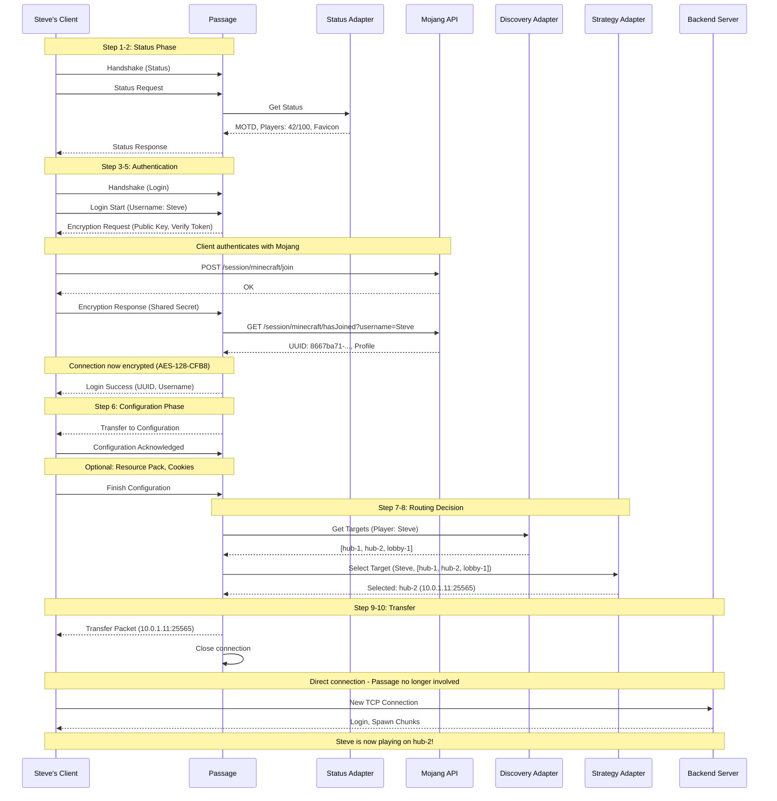

This page provides a detailed walkthrough of what happens when a player connects to your Minecraft network through Passage.

## Connection Timeline

Let's follow a player named "Steve" as they connect to `play.example.com`:



### Step 1: Initial Connection (Status Phase)

1. Steve's Minecraft client opens a TCP connection to Passage
2. Client sends a **Handshake packet** with:
   - Server address: `play.example.com`
   - Server port: `25565`
   - Protocol version: `769` (Minecraft 1.21)
   - Next state: Status (2)

3. Passage receives the handshake and transitions to **Status state**

### Step 2: Server List Ping

Passage queries the Status Adapter and returns the server information to the client. The player sees your server in their server list with the configured MOTD, player count, and favicon.

### Step 3: Login Initiation

When Steve clicks "Join Server", the client sends a Login Start packet and Passage responds with an Encryption Request containing the public key.

### Step 4: Client-Side Authentication

Steve's client now:
1. Generates a shared secret (16 random bytes)
2. Computes the server hash using Mojang's algorithm
3. **Authenticates with Mojang's session servers**:
   ```
   POST https://sessionserver.mojang.com/session/minecraft/join
   {
     "accessToken": "player's access token",
     "selectedProfile": "player's UUID",
     "serverId": "computed server hash"
   }
   ```
4. Encrypts the shared secret and verify token with Passage's public key
5. Sends **Encryption Response** to Passage

### Step 5: Server-Side Authentication

Passage decrypts the response, verifies with Mojang's `hasJoined` endpoint, and receives the player's profile (UUID, name, properties). The connection is now encrypted with AES-128-CFB8, and Passage sends Login Success.

### Step 6: Configuration Phase

Passage can optionally:
- Request the client to download resource packs
- Store cookies for authentication persistence
- Configure other client settings

### Step 7: Target Discovery

Passage queries the Target Discovery Adapter to get a list of available backend servers with their metadata (player counts, server types, etc.).

### Step 8: Target Selection

The Target Strategy Adapter selects the best server for this player based on the configured strategy (e.g., Player Fill selects the fullest server below capacity).

### Step 9: Transfer

Passage sends a Transfer Packet with the backend server's address and closes the connection. The client seamlessly reconnects to the backend server—from Steve's perspective, this is instantaneous and transparent.

### Step 10: Backend Server Connection

Steve is now fully connected to the backend server. Passage has no further involvement—Steve's packets go directly to the backend server.

## What Happens During the Connection?

### Passage Does:
✅ TCP connection handling
✅ Minecraft protocol handshake
✅ Status responses (MOTD, player count)
✅ Encryption key generation
✅ Mojang authentication verification
✅ AES-128-CFB8 encryption setup
✅ Configuration phase management
✅ Server discovery and selection
✅ Transfer packet with target address

### Passage Does NOT:
❌ Maintain persistent connections
❌ Transcode game packets
❌ Proxy gameplay traffic
❌ Store player state after transfer
❌ Handle disconnects from backend

## Timing Breakdown

Typical connection times:

| Phase | Duration | Notes |
|-------|----------|-------|
| TCP Handshake | 1-5ms | Network latency |
| Status Request | 1-10ms | Adapter query time |
| Login & Encryption | 100-500ms | Mojang API latency |
| Configuration | 10-50ms | Optional resource packs |
| Target Discovery | 1-50ms | Adapter dependent |
| Target Selection | 1-10ms | Strategy complexity |
| Transfer | 1-5ms | Packet transmission |
| Backend Connection | 50-200ms | New TCP + login |
| **Total** | **~200-800ms** | Mostly Mojang API |

The majority of time is spent waiting for Mojang's authentication servers. The actual Passage routing logic adds only ~10-60ms.

## Error Handling

### What if authentication fails?

```
Passage ← Mojang: "Invalid session"
            ↓
Steve's Client ← Disconnect
                  "Failed to verify username"
```

The player is disconnected with an error message.

### What if no backend server is available?

```
Target Discovery → Empty list []
         ↓
Target Strategy → None selected
         ↓
Steve's Client ← Disconnect
                  "No available server"
```

The player receives a localized error message (configurable).

### What if the target server is down?

This happens AFTER the transfer. The client will connect to the backend server and either:
- Get a connection refused error (server down)
- Timeout during connection
- Successfully connect

Passage has already closed the connection and has no involvement at this point.

## Cookie-Based Authentication

Passage supports authentication cookies to skip Mojang verification for returning players:

### First Connection
```
Player → Passage → Mojang (verify)
              ↓
         Cookie stored in client
```

### Subsequent Connections
```
Player → Passage (includes cookie)
         Passage verifies cookie signature
         Skip Mojang verification!
         → Transfer (much faster)
```

This reduces connection time from ~500ms to ~50ms for returning players.

## Next Steps

- Understand the [Architecture](/overview/architecture/) in detail
- Learn about [Authentication and Encryption](/overview/authentication-and-encryption/)
- Configure [Target Discovery](/customization/target-discovery-adapters/) for your network
