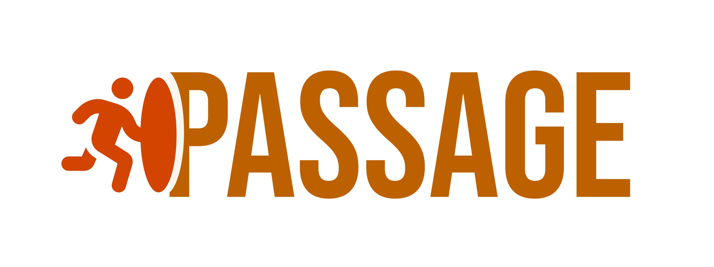

passage is a Minecraft network [transfer][transfer-packet] router to send connecting players to their corresponding
servers and act as an entrypoint to the network. While traditional Minecraft networks relied on proxies like
[BungeeCord][bungeecord-docs], [Waterfall][waterfall-docs] or [Velocity][velocity-docs], passage is only an entrypoint
and initial router and drops the connection to the player right after the routing.

## Motivation

* fast
* reliable
* no single point of failure
* improved througput
* service discovery (kubernetes)
* shielding (ddos, etc) -> backend servers are more anonymous
*

pending

## Feature Highlights

* pending

## Getting Started

> [!WARNING]
> passage is under active development and may experience breaking changes until the first version is released. After
> that version, breaking changes will be performed in adherence to [Semantic Versioning][semver-docs].

Once this project is ready, information about how to run passage will be published here. Stay tuned!

### Configuration Tweaking

To modify the behavior and global values of passage, CLI flags and environment variables may be used. To get an
overview of the available settings and their respective keys, run the following command:

```shell
passage --help
```

All settings have sensible defaults that are suitable for production deployments of passage. Still, tweaking those
settings can be beneficial for debugging or specific runtime models.

## Reporting Security Issues

To report a security issue for this project, please note our [Security Policy][security-policy].

## Code of Conduct

Participation in this project comes under the [Contributor Covenant Code of Conduct][code-of-conduct].

## How to contribute

Thanks for considering contributing to this project! In order to submit a Pull Request, please read
our [contributing][contributing-guide] guide. This project is in active development, and we're always happy to receive
new contributions!

## License

This project is developed and distributed under the MIT License. See [this explanation][mit-license-doc] for a rundown
on what that means.

[ping-protocol-docs]: https://minecraft.wiki/w/Minecraft_Wiki:Projects/wiki.vg_merge/Server_List_Ping

[rust-docs]: https://www.rust-lang.org/

[kubernetes-docs]: https://kubernetes.io/

[pvn-docs]: https://wiki.vg/Protocol_version_numbers

[transfer-packet]: https://minecraft.wiki/w/Java_Edition_protocol#Transfer_(configuration)

[bungeecord-docs]: https://github.com/SpigotMC/BungeeCord

[waterfall-docs]: https://github.com/PaperMC/Waterfall

[velocity-docs]: https://github.com/PaperMC/Velocity

[semver-docs]: https://semver.org/lang/de/

[github-releases]: https://github.com/scrayosnet/passage/releases

[github-ghcr]: https://github.com/scrayosnet/passage/pkgs/container/passage

[helm-chart-docs]: https://helm.sh/

[kustomize-docs]: https://kustomize.io/

[security-policy]: SECURITY.md

[code-of-conduct]: CODE_OF_CONDUCT.md

[contributing-guide]: CONTRIBUTING.md

[mit-license-doc]: https://choosealicense.com/licenses/mit/
